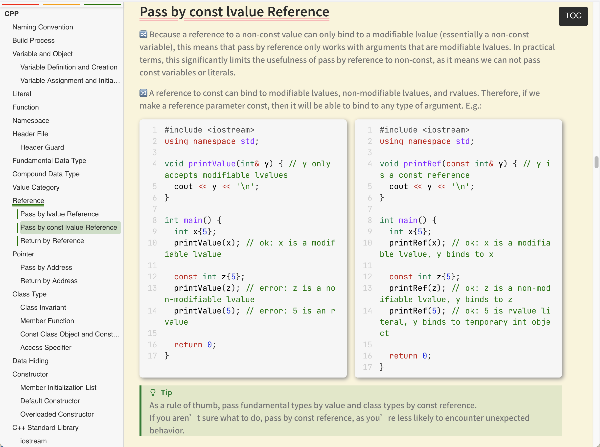
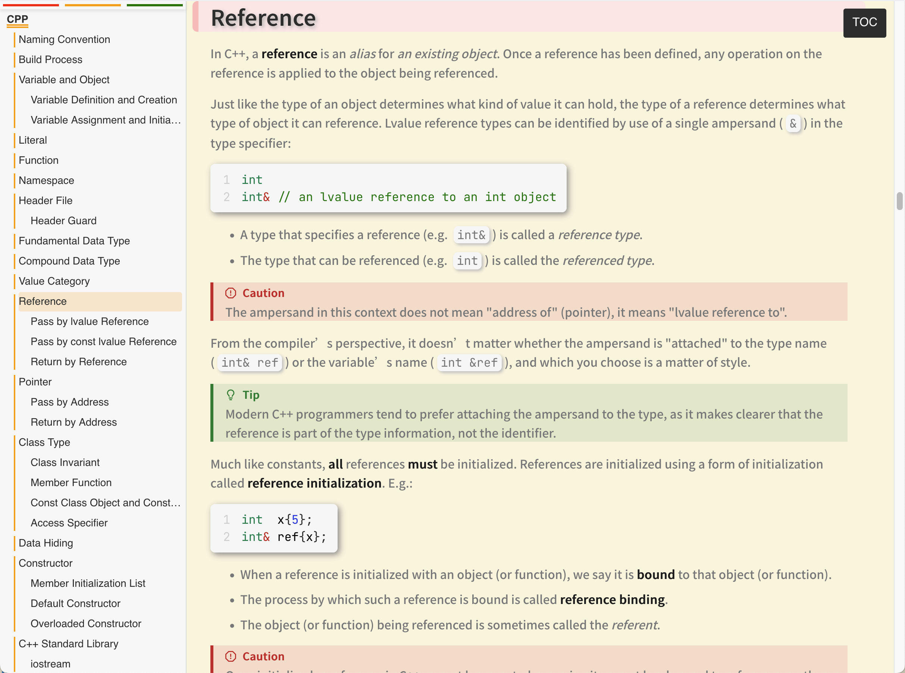

# Markdown Sidebar TOC

<div align="center">

[](https://opensource.org/licenses/MIT)
[](https://github.com/xingyuXXX/MarkdownSidebarTOC/commits/main)
[](https://makeapullrequest.com)

</div>

---

Add a sidebar TOC to your HTML notes exported from markdown.

> My skills are limited; contributions and improvement PRs are warmly welcomed!

## Demo

<table>
  <tr>
    <td></td>
    <td></td>
  </tr>
</table>

## Usage

1. Add following to your markdown file:

   ```html
   <link rel="stylesheet" href="https://xingyuxxx.github.io/MarkdownSidebarTOC/sidebar.css" />
   <script src="https://xingyuxxx.github.io/MarkdownSidebarTOC/sidebar.js"></script>
   ```

2. Export markdown file to HTML.
